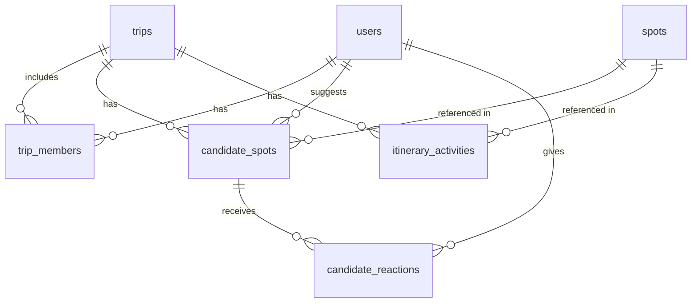

# 旅行予定管理アプリ データベース設計書

> **Version:** 3.1（Googleログイン＆カバー写真対応版）
> **最終更新日:** 2026-03-08

---

## 1. 概要

リアルタイムなタイムライン同期や候補スポット投票を備えつつ、旅行プロジェクトごとのカバー写真設定と、Googleアカウントを用いた摩擦のないユーザー登録・ログイン（OAuth）に対応したスキーマです。

### 設計方針

- **認証:** パスワードカラムは持たず、OAuth プロバイダに認証を委譲。2プロバイダまでは `users` テーブルにカラム直列で対応。
- **スポット管理:** Google Places API のキャッシュとして `spots` テーブルを独立させ、候補プールとタイムラインの両方から参照。
- **並べ替え:** タイムライン内の順序制御に辞書式順序文字列（`sort_order`）を採用し、ドラッグ＆ドロップ時の部分更新を実現。
- **監査:** 全テーブルに `created_at`（必要に応じて `updated_at`）を付与。

---

## 2. ER図

---

## 3. テーブル定義

### 3.1 ユーザー・グループ管理

#### `users`（ユーザー）

| カラム名 | データ型 | 制約 | 説明 |
|---|---|---|---|
| `id` | UUID | PK | ユーザーの一意なID |
| `google_id` | VARCHAR(255) | UNIQUE, NOT NULL | GoogleのユーザーID（sub句など） |
| `name` | VARCHAR(50) | NOT NULL | 表示名（Googleプロファイルから取得） |
| `email` | VARCHAR(255) | UNIQUE, NOT NULL | メールアドレス |
| `avatar_url` | TEXT | | アイコン画像のURL（Googleプロファイルから取得） |
| `created_at` | TIMESTAMPTZ | NOT NULL, DEFAULT now() | 作成日時 |
| `updated_at` | TIMESTAMPTZ | NOT NULL, DEFAULT now() | 更新日時 |

> **備考:** 2つ目の OAuth プロバイダ（Apple, LINE 等）を追加する場合は `apple_id` 等のカラムを追加。3プロバイダ以上になった時点で `user_auth_providers` テーブルへの分離を検討する。

#### `trips`（旅行プロジェクト）

| カラム名 | データ型 | 制約 | 説明 |
|---|---|---|---|
| `id` | UUID | PK | 旅行の一意なID |
| `title` | VARCHAR(100) | NOT NULL | 旅行のタイトル |
| `cover_photo_url` | TEXT | | 旅行のしおりの表紙（カバー写真）URL |
| `start_date` | DATE | | 出発日 |
| `end_date` | DATE | | 帰宅日 |
| `invite_code` | VARCHAR(20) | UNIQUE | 共有・招待用のユニークコード |
| `created_at` | TIMESTAMPTZ | NOT NULL, DEFAULT now() | 作成日時 |
| `updated_at` | TIMESTAMPTZ | NOT NULL, DEFAULT now() | 更新日時 |

#### `trip_members`（旅行メンバー中間テーブル）

| カラム名 | データ型 | 制約 | 説明 |
|---|---|---|---|
| `trip_id` | UUID | PK, FK → trips(id) | 参加する旅行ID |
| `user_id` | UUID | PK, FK → users(id) | ユーザーID |
| `role` | VARCHAR(20) | NOT NULL | 権限（`owner`, `editor`, `viewer`） |
| `created_at` | TIMESTAMPTZ | NOT NULL, DEFAULT now() | 参加日時 |

---

### 3.2 スポット・候補プール管理

#### `spots`（スポットマスタ / Google Places キャッシュ）

| カラム名 | データ型 | 制約 | 説明 |
|---|---|---|---|
| `id` | UUID | PK | 自社システム内の一意なスポットID |
| `google_place_id` | VARCHAR(255) | UNIQUE | Google Places APIのID |
| `name` | VARCHAR(255) | NOT NULL | 施設名・場所名 |
| `address` | TEXT | | 住所 |
| `latitude` | DOUBLE | NOT NULL | 緯度（マップピン・ルート描画用） |
| `longitude` | DOUBLE | NOT NULL | 経度（マップピン・ルート描画用） |
| `created_at` | TIMESTAMPTZ | NOT NULL, DEFAULT now() | 作成日時 |
| `updated_at` | TIMESTAMPTZ | NOT NULL, DEFAULT now() | 更新日時 |

#### `candidate_spots`（候補プール）

| カラム名 | データ型 | 制約 | 説明 |
|---|---|---|---|
| `id` | UUID | PK | 候補の一意なID |
| `trip_id` | UUID | FK → trips(id), NOT NULL | 紐づく旅行ID |
| `spot_id` | UUID | FK → spots(id), NOT NULL | 場所ID |
| `added_by` | UUID | FK → users(id), NOT NULL | 追加したユーザー |
| `status` | VARCHAR(20) | DEFAULT 'in_pool' | `in_pool`, `in_timeline` 等 |
| `created_at` | TIMESTAMPTZ | NOT NULL, DEFAULT now() | 追加日時 |

#### `candidate_reactions`（候補への投票・リアクション）

| カラム名 | データ型 | 制約 | 説明 |
|---|---|---|---|
| `id` | UUID | PK | リアクションの一意なID |
| `candidate_spot_id` | UUID | FK → candidate_spots(id), NOT NULL | どの候補に対するリアクションか |
| `user_id` | UUID | FK → users(id), NOT NULL | 誰がリアクションしたか |
| `emoji_type` | VARCHAR(20) | NOT NULL | `👍`, `👎`, `😍` など |
| `created_at` | TIMESTAMPTZ | NOT NULL, DEFAULT now() | リアクション日時 |

> **複合ユニーク制約:** `UNIQUE(candidate_spot_id, user_id, emoji_type)` — 同一ユーザーが同一候補に同じ絵文字を重複登録するのを防止。

---

### 3.3 タイムライン（予定）管理

#### `itinerary_activities`（タイムラインブロック）

| カラム名 | データ型 | 制約 | 説明 |
|---|---|---|---|
| `id` | UUID | PK | アクティビティの一意なID |
| `trip_id` | UUID | FK → trips(id), NOT NULL | 紐づく旅行ID |
| `day_number` | INT | NOT NULL | 何日目の予定か（1, 2, 3...） |
| `spot_id` | UUID | FK → spots(id), NOT NULL | 行き先の場所ID |
| `sort_order` | VARCHAR(255) | NOT NULL | 辞書式順序文字列（ドラッグ＆ドロップ制御用） |
| `start_time` | TIMESTAMPTZ | | 予定開始時刻 |
| `memo` | TEXT | | ユーザーが残せるメモ |
| `created_at` | TIMESTAMPTZ | NOT NULL, DEFAULT now() | 作成日時 |
| `updated_at` | TIMESTAMPTZ | NOT NULL, DEFAULT now() | 更新日時 |

---

## 4. テーブル一覧（サマリー）

| # | テーブル名 | 種別 | 行数見込み |
|---|---|---|---|
| 1 | `users` | マスタ | 数千〜数万 |
| 2 | `trips` | マスタ | 数千〜数万 |
| 3 | `trip_members` | 中間 | trips × 平均メンバー数 |
| 4 | `spots` | マスタ（キャッシュ） | 数万〜数十万 |
| 5 | `candidate_spots` | トランザクション | trips × 平均候補数 |
| 6 | `candidate_reactions` | トランザクション | candidate_spots × メンバー数 |
| 7 | `itinerary_activities` | トランザクション | trips × 日数 × 平均アクティビティ数 |

---

## 5. 今後の拡張検討事項

以下は現時点では未採用ですが、将来的に検討する価値のある改善案です。

| # | 項目 | 内容 |
|---|---|---|
| 1 | `itinerary_activities.spot_id` の NULLABLE 化 | 移動時間・自由行動・休憩など「場所なし」ブロックの表現。あわせて `activity_type`（`visit`, `transit`, `free_time` 等）カラムの追加。 |
| 2 | `spots` へのカテゴリ情報追加 | `place_types TEXT[]` として Google Places API の `types` をキャッシュし、フロントエンドでのフィルタリングに活用。 |
| 3 | `trip_members.role` への CHECK 制約 | `CHECK (role IN ('owner', 'editor', 'viewer'))` で不正値の混入を防止。 |
| 4 | `trips` への日付整合性 CHECK 制約 | `CHECK (start_date <= end_date)` |
| 5 | 空間インデックス | 大規模化時に `spots` テーブルへ PostGIS の GiST インデックスを追加し、近傍検索を高速化。 |
